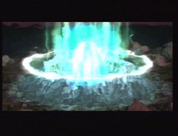
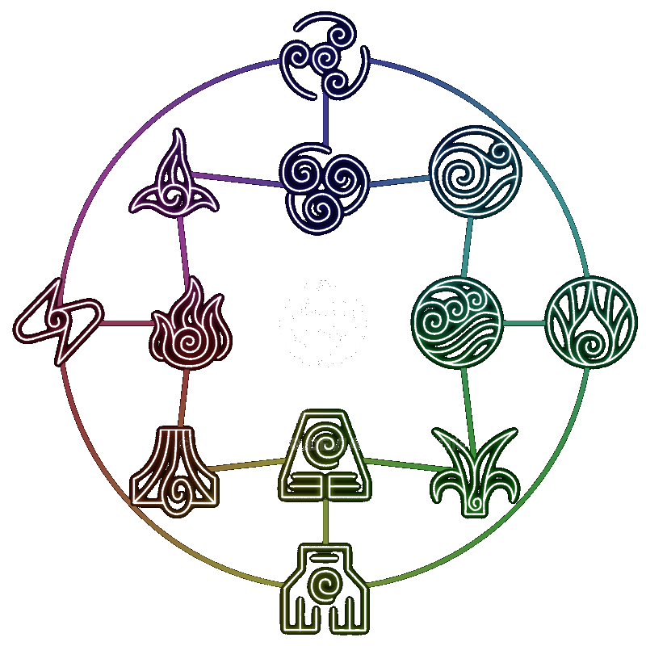

# energy system

Energy is inside the world in the form of mako, below bedrock.

## types

There will be four minor types of ** Mako ** Earth, Water, Air, Fire and one major type Pure Mako
Each minor type will have 3 subsets, Each minor type of mako will correspond with biome types.

##### Earth
MOUNTAIN
JUNGLE
FOREST

##### Air
- HILLS
- PLAINS

##### Water
- WATER
- FROZEN
- SWAMP

##### Fire
- DESERT
- NETHER

** Special types would happen when mako goes bad.**
##### corrupt types
- WASTELAND
- MAGICAL

A example of the four major types with the three subsets

Each minor type will have a PURE subset and two that are shared

Starting with
##### ** AIR **

* Wind would be the ** PURE ** subset
* Combustion Would be shared and consumed from Fire
* Snow Would be shared with and consumed by Water

##### ** WATER **

* ICE would be the ** Pure ** Subset
* Snow would be shared and consumed from AIR
* Plant would be shared and consumed by EARTH

##### ** EARTH **

* Metal would be the ** Pure ** subset
* Plant would be shared and consumed from Water
* Lava would be shared and consumed by Fire

##### ** FIRE **

* Lighting would be the ** Pure ** subset
* Lava Would be shared and consumed from Earth
* Combustion would be shared and consumed by Air

### Extracting

With the use or extraction of mako the world in the vicinity around the extraction will start to corrupt. Giving adverse effects such as imbuing normal type animals and later monsters into magical enhanced variations. There first objective would be to destroy the extraction point (think breaking a vanilla door.) Unless a player or neutral entity is in the immediate area. This along side the need for early game uses of livestock to power the drill will require devices to make your animals immune (earmuffs or something similar) to prevent them from becoming corrupt. It will also mean that your required to protect them.

#### different strength extraction spots and balance.

For balance reasons it is needed to have the opposite effect that would you get from drilling for oil in real life. When drilling from oil once you hit it the pressure sends abundance to the surface. With Mako we need to have it set for the opposite effect, Slow at the start and rapid the longer it stays extracting. With this as well we can have 3 different size fissures, Largest being something like a fountain or spring and extremely rare (Only world gen) the other two types being hidden fissures needing a scanning item or method to locate. The largest or most abundance spots will increase faster to a full yield per tick while the smaller two will just take a bit longer to get to full yield. Because of corruption effects its important that a player or server constantly has to monitor the mako levels.

### corruption
This happens when you extract any type of mako how ever it starts with each type you are corrupting. So using Fire as a example. If you where to start extracting combustion type fire mako which is a mix of Air / Fire it would corrupt that sub type and spread to its pure sibling which in this case would be lighting stopping there. If you where extracting pure lighting it would spread to both of its siblings. There is two ways to cure the corruption. If you put pure mako ore into a pure type, aka Lighting it will slowly cure the corruption of its siblings. (Rough)

### countering corruption

To counter the corruption of one type, you need to feed it energy, Naturally each type can absorb 1 subset from another as described above. As a example Air has two subsets that are shared ** Combustion Would be shared and consumed from Fire ** and ** Snow Would be shared with and consumed by Water ** This method creates a never ending loop between the four elemental mako energy. To make it so that a player or server can achieve perfect balance again, we will have shards of ** Pure ** mako crystals as rare oregen in the world. These crystals can be fed into any elemental fissure to help stabilize that element.

### Adverse effects

If the player or server leaves a Major type corrupted for two long, two bad things will of course happen. Firstly the yield of that type of mako energy would cease and be replaced by corrupted mako. This may be used by something down the line but shouldn't be something strived for. Secondly the corruption of animals and then monsters will happen, Third the world itself will start changing (Think taint) fourthly the corruption of the type of mako it absorbs will happen and 1-3 will effect that type until the loop is completed. At that point we could spawn a boss or something similar to allow the player/s to kill it and restore a ** very ** small amount of balance to each type to allow for them to start the process of cleaning up.

### The ultimate goal

Is to keep a balance to all 4 major types to with late mid game be able to produce Pure Mako energy.

### Ideas on uses

##### Spells
With each subtype of mako energy we can allow the players to compress the energy into a crystal (something like magicite) to give them spells related to that subtype, Along side the magicite the player would need storage crystals to power to the spells / magicite, Each magicite could have multiple spells associated with it and use varying amounts of energy.

##### Magic themed multi/blocks
Standard blocks from our mod that would allow for better extraction methods, Possible ore duplication methods, Pipes that allow for liquid mako to be pumped and stored into crystals or something else.

##### Forge energy and other type conversions

We could provide conversion blocks that allow for ** one ** way conversion. Such as water type converting to botania Mana and fire type converting to bloodmagic LP. This would give pack maker the ability to hopefully turn off conventional methods in other mods to use our system. Sticking with the FF inspiration this could also mean pure mako energy to be converted to forge energy to allow existing tech mods to use our Immersive take at a energy system.

### ways to use it..

For this mod, I'd like to keep it expandable in nature (think replacing thaumcraft nodes). The core mod would provide methods of getting the mako and storing it. So such as the cows being on leads walking around in circles to turn a drill for extraction. and big crystals for storage. We would flesh out the cool multi/blocks that have to do with anything mako. But not try to make a super mod and allow for it to be extended. Things like extra magicite based spells and blocks that do different things than our base mod is a good thing.
