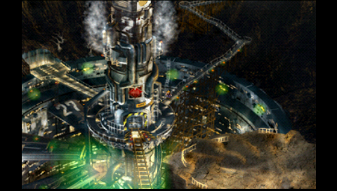
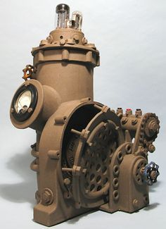
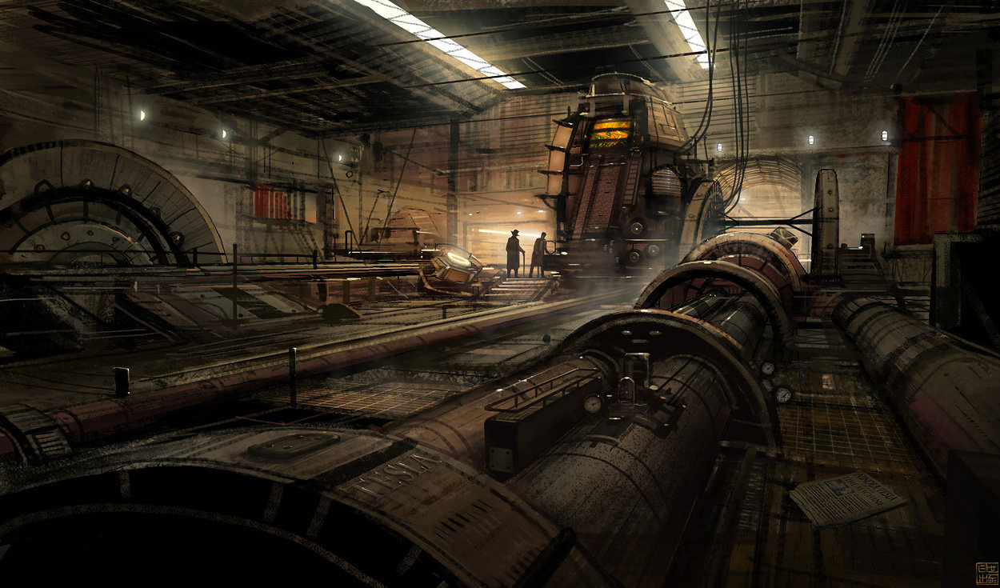
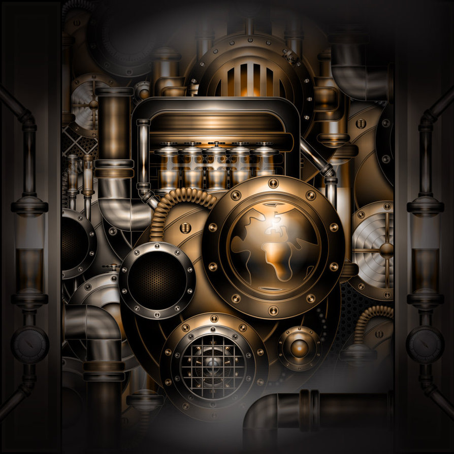

## Tech used to make magic

### Ores
Due to the nature of Mako being extremely potent it will require special types of pipes and machines to process it. These will need to be built from (yet to be named) metals in our mod. This is minecraft and apart of it is mining! Our ores will have a simple purpose to exist. They will have the quality to resist the corrosion. A good example of this would be Lead lining to resist radiation. This will give reasoning behind the why do I need a extra ore / metal when iron or what ever could work. These types of metals/materials may even be made into armor and infused to allow for materia to be socketed into each piece.

### Transportation

Our mod its machines and everything will revolve around Mako and its different types. Like mentioned in the energy docmentation. Instead of having a liquid such as OIL convert into fuel which then converts into energy to be sent out via some sort of energy pipe to power other things. Mako and its types will be transported via our own pipes into storage containers or directly into the tech to power them. Because of the many different types of mako each machine will need multiple inputs and if the mako's mix within pipes the pipes themselves should explode and if possible start leaking. (insert good idea for power loss or challenge/fear of explosion or some other effects)

### Machines

Many different types of machines or multiblocks will be needed. From something to convert our mako into Forge Energy to power other mods to fusion chambers to combine the different raw mako liquids. A machine to compress mako combinations into materia. A way to craft the armor and embed materia into slots. Some traditional blocks for grinding and magically multiplying ores and so on.

### Design

Something here

### Looks

