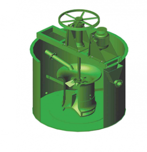
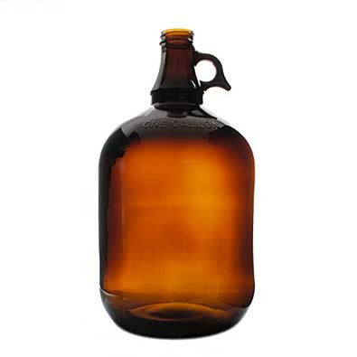

## How early game progression could go.

* The player starts out needing to find a already erupted geyser. These are rare but should be easy to spot once found due to a small surrounding corrupted biome. Player needs to be fast as corruption in the biome will hurt a exposed player.
* The player will find a materia of knowledge around the geyser, combine that with a book to get the guide and gain initial knowledge of the mysterious liquid.
* Next step is for the player to mine mako resistant ore (insert names here)
* Craft a manual agitator(working name)  This will operate similar to AE2 grinder. Needs to be heated at the bottom depending on the recipe.
* Heat the agitator like thing combine sand + ore to make liquid resistant glass.
* Put a mold into the drying device, poor mixture into it to make a resistant jug 
* Use jug to safely transport what ever type of mako back to base to put into agitator.
* Due to armor not covering your entire body like a hazmat suit. It needs to be imbued with magic plus resistant ore.
* Put mako type + resistant ore into agitator to make a infused ore blend. Poor this over chainmail or leather to get a resistant tier 1 armor.
* Combine resistant glass mixture with mako to make infused mako glass.
* Use this + ore ingots to make a tank to store the mako.
* Used to also make starting pipes. infused glass + ore = pipes. 
* Use this with gold? to make a magical scope (allows you to see geyser particles) to find different sources of mako.
