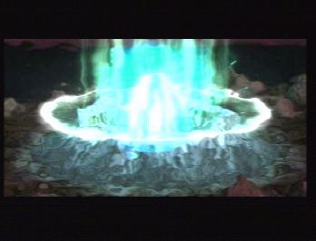
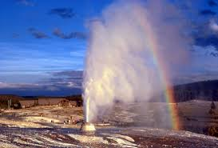

# energy system

Energy is inside the world in the form of mako, below bedrock.

## What it is

Mako is pure magic energy which is hidden deep within the world, It can be in many forms or different types such as air, earth, fire, water, darkness and so on
In this mod and the idea behind it is normal energy systems such as electric or what ever doesn't exist. There is no oil but in its place there is Mako. The player will drain the worlds natural magic to create tech and magic. Mako itself is pure and dangerous. Due to this it also corrupts the world around it once taken from the core where it is stabilized.

## How to attain it.

similar to systems used in Thaumcraft the player will first be required to have some sort of surveying equipment to spot the mako geysers barley seeping through the surface(think particles). Unless in VERY rare cases and at the start of the mods natural progression they find a natural  that is already erupted through the worlds core. These should be something similar to thaumcraft's various world gen that turns normal biomes into tainted/corrupted variants around it. The player will need to seek out this rare world gen to attain (something that generates around it not the mako itself) Using this magic item related to the mako like a corrupted berry bush that the player eats the forbidden fruit and gains the first bit of knowledge from or (insert idea here) Help the player start with the mod.

After this initial start of the mod phase is over and the surveying starts. There should be multiple types of mako energy but lets not be a total rip off of thaumcraft and have our own ideas on how to name these types. Once the mako type is found you will need to use mundane methods at first to start extracting it. (Such as having a stone drill head turned by cows attached to it with leads. The player would have to manually guide them around in circles with hay or carrots for pigs elc.) Further in the mod and would be required to upgrade this method to be able to tap bigger Tiered Geysers or different types. Such as a mako powered drill setup.

## Adverse Effects and balance

To keep the mako system complex and balanced. Geysers will erupt and produce amounts of mako every lets say 10 mins. The amount produced pre cooldown or eruption period will depend on the tier (size) of the Geyser. They will still be unlimited in a sense that the extraction would just slow down once the geyser's eruption (cooldown) amount it shoots up is depleted. Each tier would produce more or less amounts of mako after the erupted amount is depleted from extraction.

Now for the side effects and balance. So if the player keeps extracting over the amount provided from the eruption things around it will start to corrupt from draining the essence from the worlds core to fast. Also if the player cannot extract all (or most) of the mako from the eruption and leaves excess before the next corruption pressure will build up. After so much pressure the geyser will break the equipment above it and start spewing into the world and corrupting it.

This will achieve a few things. Like players will have to search for smaller variants early game as if they cannot extract and contain the mako once they tap the surface they will corrupt there world with magic which is naturally held back by the crust. It will also mean that players will have to monitor the levels and set up automated shut offs and such so that they do not over extract.

Corruption itself will of course have Adverse effects on the world but also anything that is within the corrupted biome type. Such as animals being mutated into monsters and monsters being evolved into harder types. The player itself may also be mutated or harmed due to much exposure to pure mako (think fallout radiation).

## Mako is energy
Instead of having machines use oil to produce energy, Mako is the energy. There will be no power cables only fluid.
