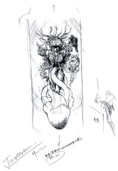

##### creatures of mako

Due to makos corruptive nature some entites like cows and zombies can be transformed from normal mako into mutated variants. This effect how ever can be used to the players advantage with the right mixture of mako in a controlled environment. Using the mixing multiblock to make the right blend of mako, you can push the entity into the (work in progress name) incubator Multiblock. To transform it into a entity that can possibly help you, How ever with the wrong mixture this may produce entities that are even stronger and completely different than when they are naturally corrupted. It may be possible to also combine two types of entities together such as a villager and a donkey to make a logistical helper creature. Due to these creatures being made from mako, a possible side effect may be mako addiction. [Reference](http://finalfantasy.wikia.com/wiki/Mako) Meaning the player will have to feed this addiction or the creature could deteriorate.  

Reference to FF7

##### Summoning materia

The Red type Materia known as the summoning materia is needed to bound these new creatures. Depending on the creature created it may require tier 1, 2 or 3 for the most powerful or helpful types. Without bounding a cooked up creature to your summoning materia it will not listen to your commands. It will also allow for a entity to be transported from location X to location Y (dont really wanna store them and become pokemon)
