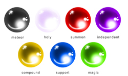
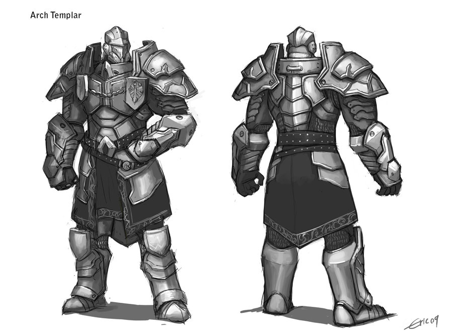
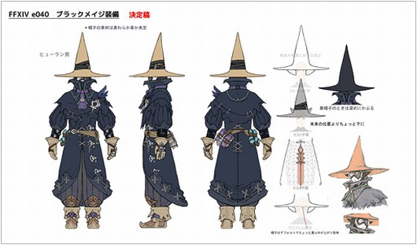
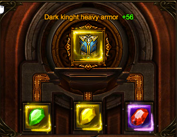
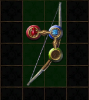

## Materia and Armor with slots.

##### How to process and make each materia will be documented with machines.

### materia

There will be several types of materia each doing a different thing. For instance drawling from FF7 inspiration

##### Green - magic
This will be your main used type of materia, Spells like fire or lighting to growth will be a green type materia.

##### Purple - Independent
As examples independent materia will cover stuff like bonus EXP, Increase max HP, Increase Range of arrows/spells and so on.

##### Red - Summon
This type would be if we added any type of minions such as golems like thaumcraft or even summoning creatures like wolves that protect the player

##### Yellow - Command
This will be physical abilities such as a spinning attack, shield bash or double jump. Very limited

##### Blue - Support
These will be used solely with slots and in conjunction with yellow or green materia when sloted together. Will add effects or modifiers like "Area" which will allow for fire ball to be casted in a area when normally casted in a single shot. Or for a mining spell to be 3x3 when it normally would only do 1x1.

##### Spell stones and tiers.

Each stone type can have tiers other than Support, weather it be a green materia that has the fire spell. or a red materia with a summon worker spell. Each materia can have up to three tiers. So using Fire as a example. Fire 1 may just be a small ranged small ember projectile. While Tier 2 may be a full fledged fireball and tier 3 would be a blue fireball Each with increased damage. Now there will be a combination of two ways to gain access to each tier. The first method would be advancing further into the mods progression to make better Materia to get you to a tier 3 capable materia. End game shit.

The other way to attain a tier 3 spell is by slotting three of the same types of materia in this example 3 green fire materia into your armor.

### Custom armors.

##### Heavy

##### Cloth

There will be two types of armors, Cloth which will allow for more slots per piece but lower defense values (max tier would be equal to leather protection) And Metal armor which will be limited to the slots allowed but provide more defense, The two types should also have restrictions on the slots themselves. For instance Cloth would have more Green slots and "anything" slots available than Metal which would have more Yellow and Purple slots available and less amounts of "anything".  

###### Socket ideas

Make it so that the armor or weapons needs to be infused with a multiblock of some sort like or have a single block with a gui like this. I do think due to the nature of the game. Setting stones into armor may need to be a permanent thing or at least cost something to remove them.

Of course there will be many types or tiers of armors available. This could go in depths to almost allow for a class type system with limiting available slots or just a basic function of allowing for more types and more slots + defense for the more advance armors. possibilities are endless with it just depends how far we want to go.    
