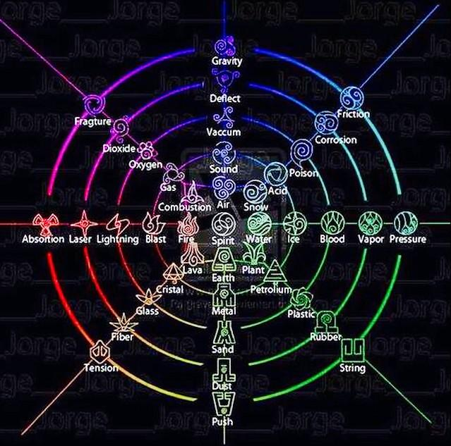

## Mako or raw/pure mako

Can be found in the world in four different types.

#### Nature

#### Fire

#### Water

#### Air

Each type of mako should be able to generate anywhere in the world. (unless climate restrictions is wanted)

While not a final design the general idea is to mix these types of mako together to create new sub types to further expand the complexity.

##### A few examples

#### Mixing!

The idea behind the mixing of elements to make something new is similar to that of chemistry. If a non valid combination is attempted, Shit goes boom. To make a valid combination you will need to use a multiblock

naturally mixing any types of mako in the world even if a valid combination will cause a chain reaction and lead to explosion and mass corruption in the area. To combat the volatile nature of mixing the player will use stabilizers. These will be our own or vanilla items. A good example would be charcoal, having 3fire, 2nature or something similar. Mixing raw fire + nature mako together may require per 1000mb of fluid 6 stabilizers consumed. How ever for each 1000mb combination you are limited to insert only (X) amount of items. So finding the right combinations for advance mixtures will be a challenge.  
